# FoodDelivery Platform - Complete Architecture Documentation

> A full-stack food delivery platform built with .NET 10 microservices, React 19 frontend, Ocelot API Gateway, RabbitMQ messaging, and SQL Server databases.

---

## Table of Contents

1. [Project Overview](#1-project-overview)
2. [Technology Stack](#2-technology-stack)
3. [High-Level Design (HLD)](#3-high-level-design-hld)
4. [System Workflow](#4-system-workflow)
5. [Low-Level Design (LLD)](#5-low-level-design-lld)
6. [Database Diagram](#6-database-diagram)
7. [Class Diagrams](#7-class-diagrams)
8. [Sequence Diagrams](#8-sequence-diagrams)
9. [Event Flow Diagram](#9-event-flow-diagram)
10. [Frontend Architecture](#10-frontend-architecture)
11. [API Gateway Routing](#11-api-gateway-routing)
12. [Authentication & Authorization Flow](#12-authentication--authorization-flow)

---

## 1. Project Overview

FoodDelivery is a microservices-based food delivery platform supporting four user roles:

| Role | Capabilities |
|------|-------------|
| **Customer** | Browse restaurants, add to cart, place orders, track delivery, rate orders, manage wallet |
| **Partner** | Manage restaurant profile, menu items, categories, operating hours, view orders, manage coupons |
| **Delivery Agent** | View available orders, accept deliveries, update delivery status |
| **Admin** | Approve restaurants, manage users, handle complaints, process refunds, view reports |

---

## 2. Technology Stack

| Layer | Technology |
|-------|-----------|
| Frontend | React 19, Vite, Tailwind CSS, React Router v7, Axios |
| API Gateway | Ocelot (.NET 10) |
| Microservices | ASP.NET Core (.NET 10), C# |
| ORM | Entity Framework Core |
| Database | SQL Server (one DB per service) |
| Messaging | RabbitMQ |
| Authentication | JWT Bearer Tokens |
| File Storage | Cloudinary |
| Payment Gateway | Razorpay (stub) |
| Email | Gmail SMTP |

---

## 3. High-Level Design (HLD)

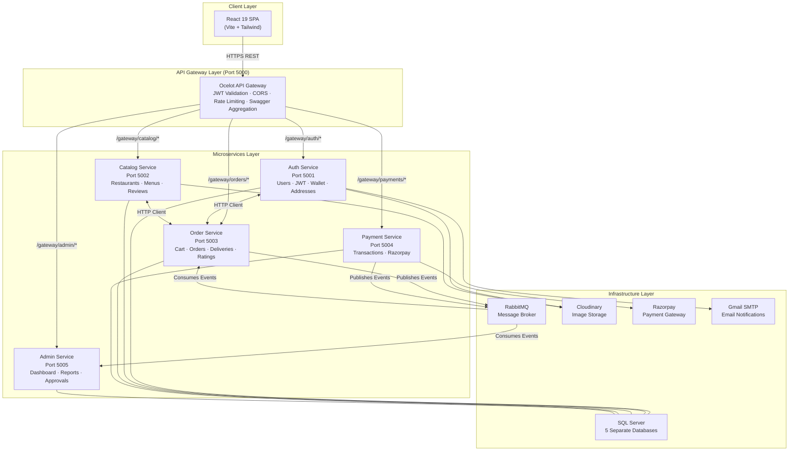
```mermaid
graph TB
    subgraph Client["Client Layer"]
        Browser["React 19 SPA<br/>(Vite + Tailwind)"]
    end

    subgraph Gateway["API Gateway Layer (Port 5000)"]
        OcelotGW["Ocelot API Gateway<br/>JWT Validation · CORS · Rate Limiting · Swagger Aggregation"]
    end

    subgraph Services["Microservices Layer"]
        AuthSvc["Auth Service<br/>Port 5001<br/>Users · JWT · Wallet · Addresses"]
        CatalogSvc["Catalog Service<br/>Port 5002<br/>Restaurants · Menus · Reviews"]
        OrderSvc["Order Service<br/>Port 5003<br/>Cart · Orders · Deliveries · Ratings"]
        PaymentSvc["Payment Service<br/>Port 5004<br/>Transactions · Razorpay"]
        AdminSvc["Admin Service<br/>Port 5005<br/>Dashboard · Reports · Approvals"]
    end

    subgraph Infra["Infrastructure Layer"]
        RabbitMQ["RabbitMQ<br/>Message Broker"]
        SQLServer["SQL Server<br/>5 Separate Databases"]
        Cloudinary["Cloudinary<br/>Image Storage"]
        Razorpay["Razorpay<br/>Payment Gateway"]
        Gmail["Gmail SMTP<br/>Email Notifications"]
    end

    Browser -->|HTTPS REST| OcelotGW
    OcelotGW -->|/gateway/auth/*| AuthSvc
    OcelotGW -->|/gateway/catalog/*| CatalogSvc
    OcelotGW -->|/gateway/orders/*| OrderSvc
    OcelotGW -->|/gateway/payments/*| PaymentSvc
    OcelotGW -->|/gateway/admin/*| AdminSvc

    AuthSvc <-->|HTTP Client| OrderSvc
    CatalogSvc <-->|HTTP Client| OrderSvc
    OrderSvc -->|Publishes Events| RabbitMQ
    PaymentSvc -->|Publishes Events| RabbitMQ
    RabbitMQ -->|Consumes Events| OrderSvc
    RabbitMQ -->|Consumes Events| AdminSvc

    AuthSvc --- SQLServer
    CatalogSvc --- SQLServer
    OrderSvc --- SQLServer
    PaymentSvc --- SQLServer
    AdminSvc --- SQLServer

    AuthSvc --> Cloudinary
    CatalogSvc --> Cloudinary
    PaymentSvc --> Razorpay
    AuthSvc --> Gmail
```

---

## 4. System Workflow

### End-to-End Order Placement Workflow

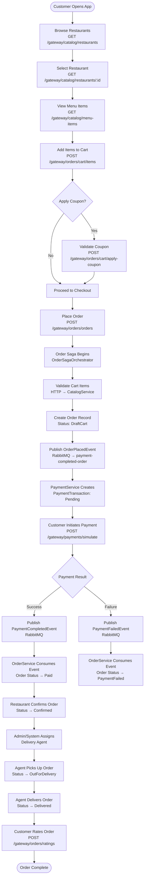
```mermaid
flowchart TD
    A([Customer Opens App]) --> B[Browse Restaurants\nGET /gateway/catalog/restaurants]
    B --> C[Select Restaurant\nGET /gateway/catalog/restaurants/:id]
    C --> D[View Menu Items\nGET /gateway/catalog/menu-items]
    D --> E[Add Items to Cart\nPOST /gateway/orders/cart/items]
    E --> F{Apply Coupon?}
    F -->|Yes| G[Validate Coupon\nPOST /gateway/orders/cart/apply-coupon]
    F -->|No| H[Proceed to Checkout]
    G --> H
    H --> I[Place Order\nPOST /gateway/orders/orders]
    I --> J[Order Saga Begins\nOrderSagaOrchestrator]
    J --> K[Validate Cart Items\nHTTP → CatalogService]
    K --> L[Create Order Record\nStatus: DraftCart]
    L --> M[Publish OrderPlacedEvent\nRabbitMQ → payment-completed-order]
    M --> N[PaymentService Creates\nPaymentTransaction: Pending]
    N --> O[Customer Initiates Payment\nPOST /gateway/payments/simulate]
    O --> P{Payment Result}
    P -->|Success| Q[Publish PaymentCompletedEvent\nRabbitMQ]
    P -->|Failure| R[Publish PaymentFailedEvent\nRabbitMQ]
    Q --> S[OrderService Consumes Event\nOrder Status → Paid]
    R --> T[OrderService Consumes Event\nOrder Status → PaymentFailed]
    S --> U[Restaurant Confirms Order\nStatus → Confirmed]
    U --> V[Admin/System Assigns\nDelivery Agent]
    V --> W[Agent Picks Up Order\nStatus → OutForDelivery]
    W --> X[Agent Delivers Order\nStatus → Delivered]
    X --> Y[Customer Rates Order\nPOST /gateway/orders/ratings]
    Y --> Z([Order Complete])
```

### Restaurant Onboarding Workflow

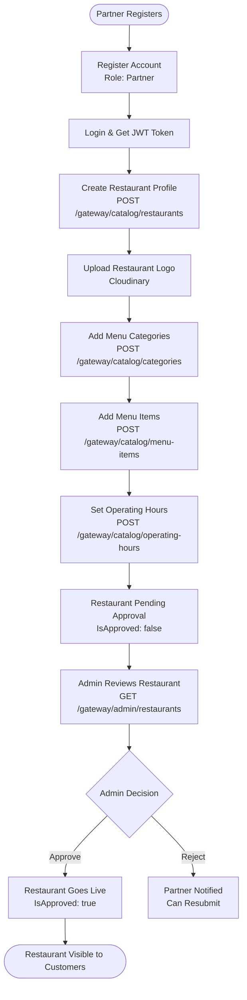
```mermaid
flowchart TD
    A([Partner Registers]) --> B[Register Account\nRole: Partner]
    B --> C[Login & Get JWT Token]
    C --> D[Create Restaurant Profile\nPOST /gateway/catalog/restaurants]
    D --> E[Upload Restaurant Logo\nCloudinary]
    E --> F[Add Menu Categories\nPOST /gateway/catalog/categories]
    F --> G[Add Menu Items\nPOST /gateway/catalog/menu-items]
    G --> H[Set Operating Hours\nPOST /gateway/catalog/operating-hours]
    H --> I[Restaurant Pending Approval\nIsApproved: false]
    I --> J[Admin Reviews Restaurant\nGET /gateway/admin/restaurants]
    J --> K{Admin Decision}
    K -->|Approve| L[Restaurant Goes Live\nIsApproved: true]
    K -->|Reject| M[Partner Notified\nCan Resubmit]
    L --> N([Restaurant Visible to Customers])
```

---

## 5. Low-Level Design (LLD)

### 5.1 Auth Service - Internal Architecture

**Port:** 5001 | **Database:** FoodDelivery_AuthDb

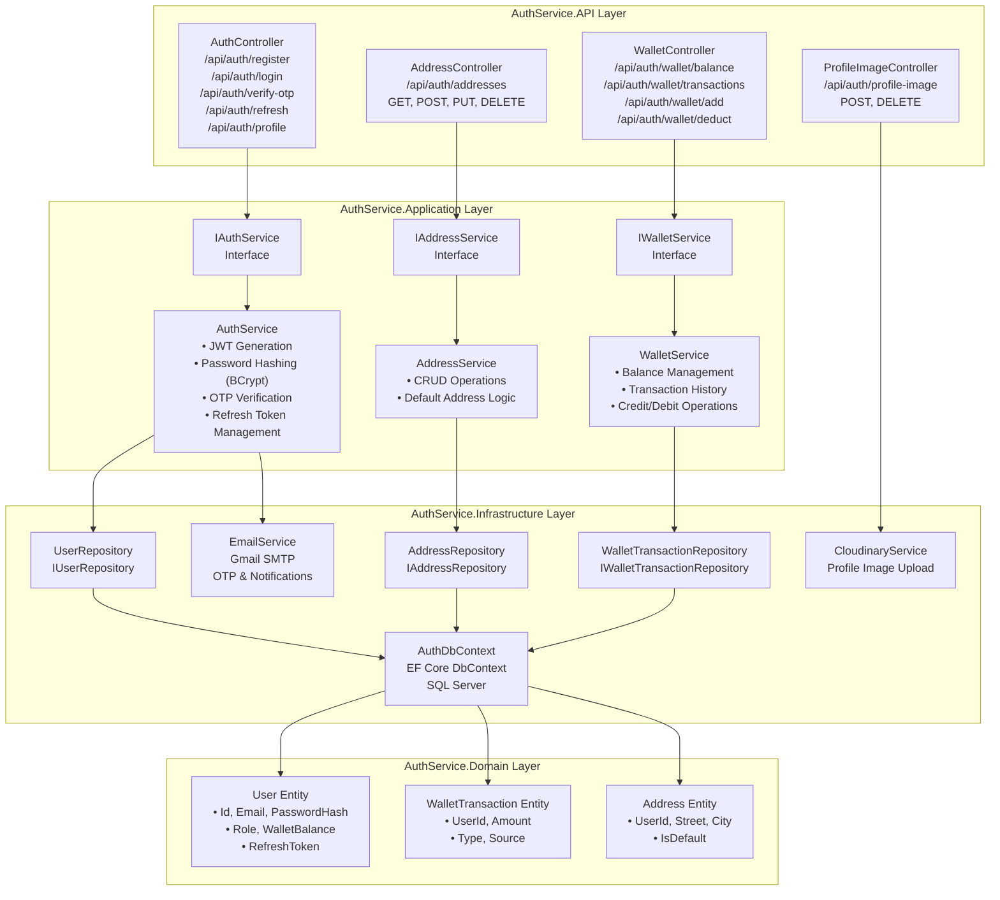
```mermaid
graph TB
    subgraph AuthAPI["AuthService.API Layer"]
        AC["AuthController<br/>/api/auth/register<br/>/api/auth/login<br/>/api/auth/verify-otp<br/>/api/auth/refresh<br/>/api/auth/profile"]
        AddrC["AddressController<br/>/api/auth/addresses<br/>GET, POST, PUT, DELETE"]
        WalC["WalletController<br/>/api/auth/wallet/balance<br/>/api/auth/wallet/transactions<br/>/api/auth/wallet/add<br/>/api/auth/wallet/deduct"]
        PicC["ProfileImageController<br/>/api/auth/profile-image<br/>POST, DELETE"]
    end

    subgraph AuthApp["AuthService.Application Layer"]
        IAS["IAuthService<br/>Interface"]
        IWS["IWalletService<br/>Interface"]
        IAddrS["IAddressService<br/>Interface"]
        AS["AuthService<br/>• JWT Generation<br/>• Password Hashing (BCrypt)<br/>• OTP Verification<br/>• Refresh Token Management"]
        WS["WalletService<br/>• Balance Management<br/>• Transaction History<br/>• Credit/Debit Operations"]
        AddrS["AddressService<br/>• CRUD Operations<br/>• Default Address Logic"]
    end

    subgraph AuthInfra["AuthService.Infrastructure Layer"]
        AuthRepo["UserRepository<br/>IUserRepository"]
        WalRepo["WalletTransactionRepository<br/>IWalletTransactionRepository"]
        AddrRepo["AddressRepository<br/>IAddressRepository"]
        EmailSvc["EmailService<br/>Gmail SMTP<br/>OTP & Notifications"]
        CloudSvc["CloudinaryService<br/>Profile Image Upload"]
        AuthDbCtx["AuthDbContext<br/>EF Core DbContext<br/>SQL Server"]
    end

    subgraph AuthDomain["AuthService.Domain Layer"]
        UserEnt["User Entity<br/>• Id, Email, PasswordHash<br/>• Role, WalletBalance<br/>• RefreshToken"]
        WalEnt["WalletTransaction Entity<br/>• UserId, Amount<br/>• Type, Source"]
        AddrEnt["Address Entity<br/>• UserId, Street, City<br/>• IsDefault"]
    end

    AC --> IAS --> AS
    WalC --> IWS --> WS
    AddrC --> IAddrS --> AddrS
    AS --> AuthRepo --> AuthDbCtx --> UserEnt
    WS --> WalRepo --> AuthDbCtx --> WalEnt
    AddrS --> AddrRepo --> AuthDbCtx --> AddrEnt
    AS --> EmailSvc
    PicC --> CloudSvc
```

**Key Features:**
- JWT token generation with 60-minute expiry
- Refresh token mechanism for extended sessions
- BCrypt password hashing
- Email OTP verification
- Wallet balance management with transaction history
- Multiple address support with default address logic
- Cloudinary integration for profile images

---

### 5.2 Catalog Service - Internal Architecture

**Port:** 5002 | **Database:** FoodDelivery_CatalogDB

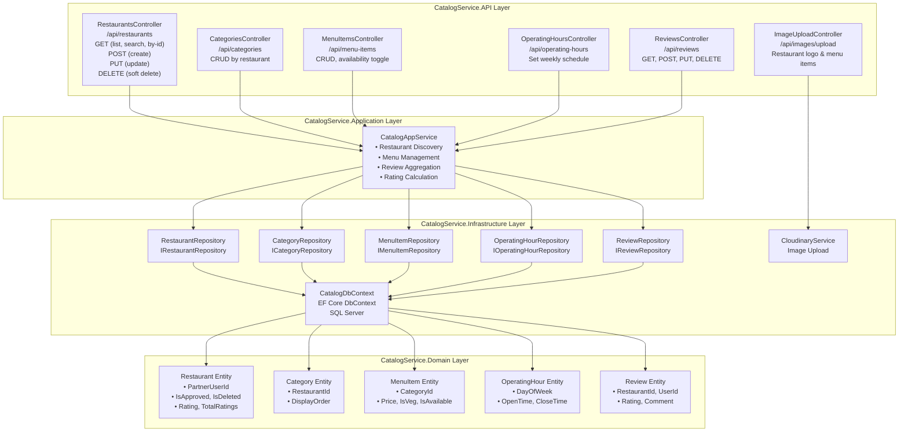
```mermaid
graph TB
    subgraph CatalogAPI["CatalogService.API Layer"]
        RestCtrl["RestaurantsController<br/>/api/restaurants<br/>GET (list, search, by-id)<br/>POST (create)<br/>PUT (update)<br/>DELETE (soft delete)"]
        CatCtrl["CategoriesController<br/>/api/categories<br/>CRUD by restaurant"]
        MenuCtrl["MenuItemsController<br/>/api/menu-items<br/>CRUD, availability toggle"]
        OpHrCtrl["OperatingHoursController<br/>/api/operating-hours<br/>Set weekly schedule"]
        RevCtrl["ReviewsController<br/>/api/reviews<br/>GET, POST, PUT, DELETE"]
        ImgCtrl["ImageUploadController<br/>/api/images/upload<br/>Restaurant logo & menu items"]
    end

    subgraph CatalogApp["CatalogService.Application Layer"]
        CatalogSvc["CatalogAppService<br/>• Restaurant Discovery<br/>• Menu Management<br/>• Review Aggregation<br/>• Rating Calculation"]
    end

    subgraph CatalogInfra["CatalogService.Infrastructure Layer"]
        RestRepo["RestaurantRepository<br/>IRestaurantRepository"]
        CatRepo["CategoryRepository<br/>ICategoryRepository"]
        MenuRepo["MenuItemRepository<br/>IMenuItemRepository"]
        OpHrRepo["OperatingHourRepository<br/>IOperatingHourRepository"]
        RevRepo["ReviewRepository<br/>IReviewRepository"]
        CloudSvc["CloudinaryService<br/>Image Upload"]
        CatalogDbCtx["CatalogDbContext<br/>EF Core DbContext<br/>SQL Server"]
    end

    subgraph CatalogDomain["CatalogService.Domain Layer"]
        RestEnt["Restaurant Entity<br/>• PartnerUserId<br/>• IsApproved, IsDeleted<br/>• Rating, TotalRatings"]
        CatEnt["Category Entity<br/>• RestaurantId<br/>• DisplayOrder"]
        MenuEnt["MenuItem Entity<br/>• CategoryId<br/>• Price, IsVeg, IsAvailable"]
        OpHrEnt["OperatingHour Entity<br/>• DayOfWeek<br/>• OpenTime, CloseTime"]
        RevEnt["Review Entity<br/>• RestaurantId, UserId<br/>• Rating, Comment"]
    end

    RestCtrl --> CatalogSvc
    CatCtrl --> CatalogSvc
    MenuCtrl --> CatalogSvc
    OpHrCtrl --> CatalogSvc
    RevCtrl --> CatalogSvc
    ImgCtrl --> CloudSvc

    CatalogSvc --> RestRepo --> CatalogDbCtx --> RestEnt
    CatalogSvc --> CatRepo --> CatalogDbCtx --> CatEnt
    CatalogSvc --> MenuRepo --> CatalogDbCtx --> MenuEnt
    CatalogSvc --> OpHrRepo --> CatalogDbCtx --> OpHrEnt
    CatalogSvc --> RevRepo --> CatalogDbCtx --> RevEnt
```

**Key Features:**
- Restaurant discovery with search and filtering
- Menu management with categories and items
- Operating hours with weekly schedule
- Review and rating system with aggregation
- Soft delete for restaurants
- Approval workflow (IsApproved flag)
- Cloudinary integration for restaurant logos and menu item images

---

### 5.3 Order Service - Internal Architecture (Saga Pattern)

**Port:** 5003 | **Database:** FoodDelivery_OrderDB


```mermaid
graph TB
    subgraph OrderAPI["OrderService.API Layer"]
        CartCtrl["CartController<br/>/api/cart<br/>GET, POST (add item)<br/>PUT (update item)<br/>DELETE (remove item)<br/>POST /apply-coupon"]
        OrderCtrl["OrdersController<br/>/api/orders<br/>GET (list, by-id)<br/>POST (place order)<br/>PUT (update status)<br/>DELETE (cancel)"]
        DelivCtrl["DeliveriesController<br/>/api/deliveries<br/>GET /available<br/>PUT /accept<br/>PUT /status"]
        PayCtrl["PaymentsController<br/>/api/payments<br/>POST /simulate"]
        RateCtrl["RatingsController<br/>/api/ratings<br/>GET, POST, PUT, DELETE"]
        RefCtrl["RefundController<br/>/api/refunds<br/>POST (initiate refund)"]
        CoupCtrl["CouponsController<br/>/api/coupons<br/>CRUD, validate"]
    end

    subgraph OrderApp["OrderService.Application Layer"]
        CartSvc["CartAppService<br/>• Add/Remove Items<br/>• Apply Coupon<br/>• Calculate Totals"]
        OrderSvc["OrderAppService<br/>• Place Order<br/>• Update Status<br/>• Cancel Order"]
        Saga["OrderSagaOrchestrator<br/>• Validate Cart Items<br/>• Create Order<br/>• Publish Events<br/>• Compensation Logic"]
        DelivSvc["DeliveryAppService<br/>• Assign Agent<br/>• Track Status<br/>• Status History"]
        RateSvc["RatingAppService<br/>• Add/Update Ratings<br/>• Calculate Averages"]
        CoupSvc["CouponAppService<br/>• Validate Coupon<br/>• Apply Discount"]
    end

    subgraph OrderInfra["OrderService.Infrastructure Layer"]
        CartRepo["CartRepository"]
        OrderRepo["OrderRepository"]
        DelivRepo["DeliveryAssignmentRepository"]
        RateRepo["OrderRatingRepository"]
        CoupRepo["CouponRepository"]
        CatalogClient["CatalogServiceClient<br/>HTTP → Port 5002<br/>Validate Menu Items"]
        AuthClient["AuthServiceClient<br/>HTTP → Port 5001<br/>Get User Data"]
        MQPublisher["RabbitMQ Publisher<br/>OrderPlacedEvent"]
        PayConsumer["PaymentCompletedConsumer<br/>Consumes from RabbitMQ<br/>Update Order → Paid"]
        FailConsumer["PaymentFailedConsumer<br/>Consumes from RabbitMQ<br/>Update Order → Failed"]
        OrderDbCtx["OrderDbContext<br/>EF Core DbContext<br/>SQL Server"]
    end

    subgraph OrderDomain["OrderService.Domain Layer"]
        CartEnt["Cart & CartItem Entities"]
        OrderEnt["Order & OrderItem Entities<br/>OrderStatus Enum"]
        DelivEnt["DeliveryAssignment Entity<br/>DeliveryStatusHistory"]
        RateEnt["OrderRating Entity"]
        CoupEnt["Coupon Entity"]
    end

    CartCtrl --> CartSvc
    OrderCtrl --> OrderSvc --> Saga
    DelivCtrl --> DelivSvc
    RateCtrl --> RateSvc
    CoupCtrl --> CoupSvc

    Saga --> CatalogClient
    Saga --> AuthClient
    Saga --> MQPublisher
    PayConsumer --> OrderSvc
    FailConsumer --> OrderSvc

    CartSvc --> CartRepo --> OrderDbCtx --> CartEnt
    OrderSvc --> OrderRepo --> OrderDbCtx --> OrderEnt
    DelivSvc --> DelivRepo --> OrderDbCtx --> DelivEnt
    RateSvc --> RateRepo --> OrderDbCtx --> RateEnt
    CoupSvc --> CoupRepo --> OrderDbCtx --> CoupEnt
```

**Key Features:**
- **Saga Pattern:** OrderSagaOrchestrator coordinates distributed transactions
- Cart management with coupon application
- Order placement with status tracking (DraftCart → Paid → Confirmed → OutForDelivery → Delivered)
- Delivery assignment and tracking with status history
- Rating system for orders
- Coupon validation and discount calculation
- **Inter-service communication:** HTTP calls to CatalogService and AuthService
- **Event-driven:** Publishes OrderPlacedEvent, consumes PaymentCompletedEvent and PaymentFailedEvent

---

### 5.4 Payment Service - Internal Architecture

**Port:** 5004 | **Database:** FoodDelivery_PaymentDB

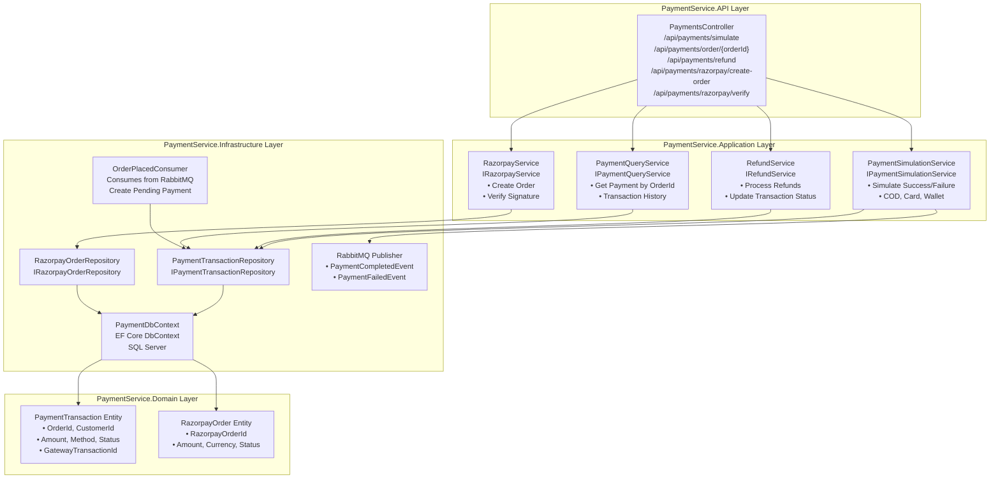
```mermaid
graph TB
    subgraph PaymentAPI["PaymentService.API Layer"]
        PayCtrl["PaymentsController<br/>/api/payments/simulate<br/>/api/payments/order/{orderId}<br/>/api/payments/refund<br/>/api/payments/razorpay/create-order<br/>/api/payments/razorpay/verify"]
    end

    subgraph PaymentApp["PaymentService.Application Layer"]
        SimSvc["PaymentSimulationService<br/>IPaymentSimulationService<br/>• Simulate Success/Failure<br/>• COD, Card, Wallet"]
        RazorSvc["RazorpayService<br/>IRazorpayService<br/>• Create Order<br/>• Verify Signature"]
        RefSvc["RefundService<br/>IRefundService<br/>• Process Refunds<br/>• Update Transaction Status"]
        QuerySvc["PaymentQueryService<br/>IPaymentQueryService<br/>• Get Payment by OrderId<br/>• Transaction History"]
    end

    subgraph PaymentInfra["PaymentService.Infrastructure Layer"]
        PayRepo["PaymentTransactionRepository<br/>IPaymentTransactionRepository"]
        RazorRepo["RazorpayOrderRepository<br/>IRazorpayOrderRepository"]
        MQPublisher["RabbitMQ Publisher<br/>• PaymentCompletedEvent<br/>• PaymentFailedEvent"]
        OrderConsumer["OrderPlacedConsumer<br/>Consumes from RabbitMQ<br/>Create Pending Payment"]
        PaymentDbCtx["PaymentDbContext<br/>EF Core DbContext<br/>SQL Server"]
    end

    subgraph PaymentDomain["PaymentService.Domain Layer"]
        PayEnt["PaymentTransaction Entity<br/>• OrderId, CustomerId<br/>• Amount, Method, Status<br/>• GatewayTransactionId"]
        RazorEnt["RazorpayOrder Entity<br/>• RazorpayOrderId<br/>• Amount, Currency, Status"]
    end

    PayCtrl --> SimSvc
    PayCtrl --> RazorSvc
    PayCtrl --> RefSvc
    PayCtrl --> QuerySvc

    SimSvc --> PayRepo --> PaymentDbCtx --> PayEnt
    RazorSvc --> RazorRepo --> PaymentDbCtx --> RazorEnt
    RefSvc --> PayRepo
    QuerySvc --> PayRepo

    SimSvc --> MQPublisher
    OrderConsumer --> PayRepo
```

**Key Features:**
- Payment simulation for testing (COD, Card, Wallet)
- Razorpay integration (stub implementation)
- Refund processing
- Transaction history and query
- **Event-driven:** Publishes PaymentCompletedEvent and PaymentFailedEvent
- **Event consumer:** Listens to OrderPlacedEvent to create pending payment records

---

### 5.5 Admin Service - Internal Architecture

**Port:** 5005 | **Database:** FoodDelivery_AdminDb


```mermaid
graph TB
    subgraph AdminAPI["AdminService.API Layer"]
        DashCtrl["DashboardController<br/>/api/admin/dashboard<br/>GET metrics"]
        RestCtrl["RestaurantsController<br/>/api/admin/restaurants<br/>GET pending<br/>PUT approve/reject"]
        AgentCtrl["DeliveryAgentsController<br/>/api/admin/delivery-agents<br/>CRUD, status toggle"]
        ComplCtrl["ComplaintsController<br/>/api/admin/complaints<br/>GET, POST, PUT (resolve)"]
        RefCtrl["RefundManagementController<br/>/api/admin/refunds<br/>GET, POST (process)"]
        NotifCtrl["NotificationsController<br/>/api/admin/notifications<br/>POST (send notification)"]
    end

    subgraph AdminApp["AdminService.Application Layer"]
        DashSvc["AdminDashboardService<br/>• Aggregate Metrics<br/>• Revenue Reports<br/>• Top Restaurants"]
        RestSvc["AdminRestaurantService<br/>• Approve/Reject<br/>• Manage Restaurants"]
        AgentSvc["AdminDeliveryAgentService<br/>• Agent Management<br/>• Status Toggle"]
        ComplSvc["AdminComplaintService<br/>• Handle Complaints<br/>• Resolution Tracking"]
        OrderSvc["AdminOrderService<br/>• Order Overrides<br/>• Status Management"]
        NotifSvc["AdminNotificationService<br/>• Send Notifications<br/>• Email/SMS"]
    end

    subgraph AdminInfra["AdminService.Infrastructure Layer"]
        UserRepo["UserSnapshotRepository"]
        RestRepo["RestaurantSnapshotRepository"]
        AgentRepo["DeliveryAgentSnapshotRepository"]
        ComplRepo["ComplaintRepository"]
        NotifRepo["NotificationHistoryRepository"]
        CatalogClient["CatalogServiceClient<br/>HTTP → Port 5002"]
        OrderClient["OrderServiceClient<br/>HTTP → Port 5003"]
        AuthClient["AuthServiceClient<br/>HTTP → Port 5001"]
        PaymentClient["PaymentServiceClient<br/>HTTP → Port 5004"]
        UserConsumer["UserRegisteredConsumer<br/>Consumes from RabbitMQ<br/>Snapshot User Data"]
        AdminDbCtx["AdminDbContext<br/>EF Core DbContext<br/>SQL Server"]
    end

    subgraph AdminDomain["AdminService.Domain Layer"]
        UserSnap["UserSnapshot Entity<br/>Cached user data"]
        RestSnap["RestaurantSnapshot Entity<br/>Cached restaurant data"]
        AgentSnap["DeliveryAgentSnapshot Entity"]
        ComplEnt["Complaint Entity"]
        NotifEnt["NotificationHistory Entity"]
    end

    DashCtrl --> DashSvc
    RestCtrl --> RestSvc
    AgentCtrl --> AgentSvc
    ComplCtrl --> ComplSvc
    RefCtrl --> OrderSvc
    NotifCtrl --> NotifSvc

    DashSvc --> CatalogClient
    DashSvc --> OrderClient
    DashSvc --> AuthClient
    RestSvc --> CatalogClient
    OrderSvc --> OrderClient
    OrderSvc --> PaymentClient

    DashSvc --> UserRepo --> AdminDbCtx --> UserSnap
    RestSvc --> RestRepo --> AdminDbCtx --> RestSnap
    AgentSvc --> AgentRepo --> AdminDbCtx --> AgentSnap
    ComplSvc --> ComplRepo --> AdminDbCtx --> ComplEnt
    NotifSvc --> NotifRepo --> AdminDbCtx --> NotifEnt

    UserConsumer --> UserRepo
```

**Key Features:**
- Dashboard with aggregated metrics from all services
- Restaurant approval workflow
- User and delivery agent management
- Complaint handling and resolution
- Refund processing
- Notification system
- **Data snapshots:** Caches user and restaurant data for faster queries
- **Inter-service communication:** HTTP calls to all other services for data aggregation
- **Event consumer:** Listens to UserRegisteredEvent to create user snapshots

---

## 6. Database Diagrams

> Each microservice owns its own isolated SQL Server database. Cross-service data references use IDs only — no foreign key constraints across databases.

---

### 6.1 Auth Service Database — `FoodDelivery_AuthDb`

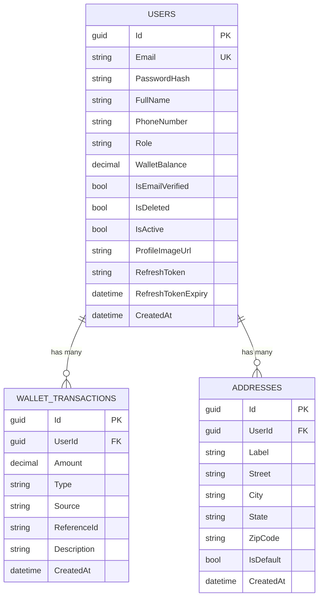
```mermaid
erDiagram
    USERS {
        guid Id PK
        string Email UK
        string PasswordHash
        string FullName
        string PhoneNumber
        string Role
        decimal WalletBalance
        bool IsEmailVerified
        bool IsDeleted
        bool IsActive
        string ProfileImageUrl
        string RefreshToken
        datetime RefreshTokenExpiry
        datetime CreatedAt
    }

    WALLET_TRANSACTIONS {
        guid Id PK
        guid UserId FK
        decimal Amount
        string Type
        string Source
        string ReferenceId
        string Description
        datetime CreatedAt
    }

    ADDRESSES {
        guid Id PK
        guid UserId FK
        string Label
        string Street
        string City
        string State
        string ZipCode
        bool IsDefault
        datetime CreatedAt
    }

    USERS ||--o{ WALLET_TRANSACTIONS : "has many"
    USERS ||--o{ ADDRESSES : "has many"
```

**Tables:** 3 | **Key relationships:** User → WalletTransactions (1:N), User → Addresses (1:N)

**Notes:**
- `Role` is a string enum: `Customer`, `Partner`, `Admin`, `DeliveryAgent`
- `WalletBalance` is denormalized on User for fast reads; WalletTransactions is the audit log
- `IsDeleted` enables soft delete; `IsActive` enables account suspension
- `RefreshToken` + `RefreshTokenExpiry` stored for JWT refresh flow

---

### 6.2 Catalog Service Database — `FoodDelivery_CatalogDB`

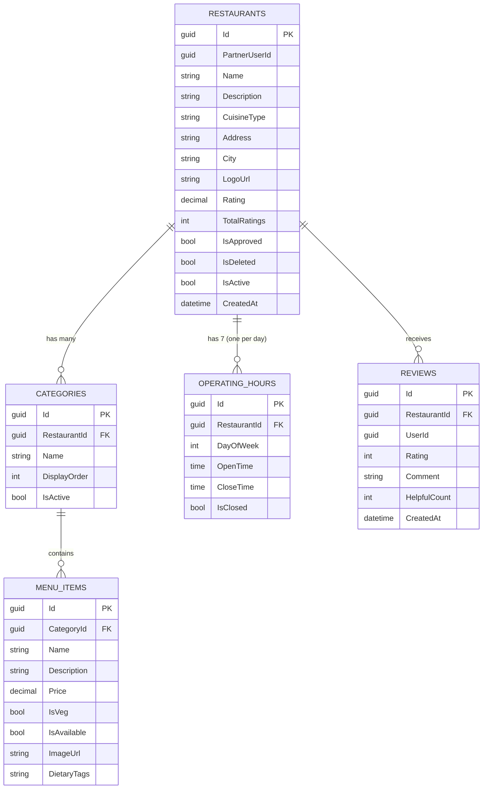
```mermaid
erDiagram
    RESTAURANTS {
        guid Id PK
        guid PartnerUserId
        string Name
        string Description
        string CuisineType
        string Address
        string City
        string LogoUrl
        decimal Rating
        int TotalRatings
        bool IsApproved
        bool IsDeleted
        bool IsActive
        datetime CreatedAt
    }

    CATEGORIES {
        guid Id PK
        guid RestaurantId FK
        string Name
        int DisplayOrder
        bool IsActive
    }

    MENU_ITEMS {
        guid Id PK
        guid CategoryId FK
        string Name
        string Description
        decimal Price
        bool IsVeg
        bool IsAvailable
        string ImageUrl
        string DietaryTags
    }

    OPERATING_HOURS {
        guid Id PK
        guid RestaurantId FK
        int DayOfWeek
        time OpenTime
        time CloseTime
        bool IsClosed
    }

    REVIEWS {
        guid Id PK
        guid RestaurantId FK
        guid UserId
        int Rating
        string Comment
        int HelpfulCount
        datetime CreatedAt
    }

    RESTAURANTS ||--o{ CATEGORIES : "has many"
    CATEGORIES ||--o{ MENU_ITEMS : "contains"
    RESTAURANTS ||--o{ OPERATING_HOURS : "has 7 (one per day)"
    RESTAURANTS ||--o{ REVIEWS : "receives"
```

**Tables:** 5 | **Key relationships:** Restaurant → Categories → MenuItems (hierarchical), Restaurant → OperatingHours (1:7), Restaurant → Reviews (1:N)

**Notes:**
- `PartnerUserId` references AuthService Users — no FK constraint (cross-service)
- `Rating` and `TotalRatings` are denormalized aggregates recalculated on each review
- `DisplayOrder` on Category controls menu section ordering
- `DietaryTags` on MenuItem is a comma-separated string (e.g., `"Vegan,GlutenFree"`)
- `IsApproved: false` means restaurant is pending admin review and hidden from customers

---

### 6.3 Order Service Database — `FoodDelivery_OrderDB`

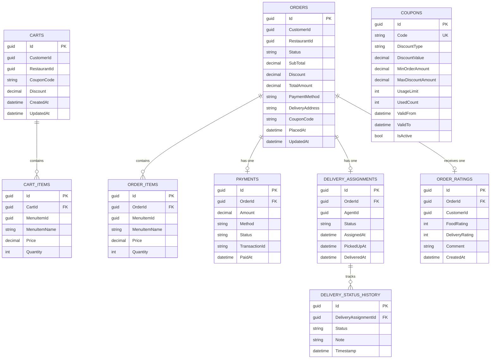
```mermaid
erDiagram
    CARTS {
        guid Id PK
        guid CustomerId
        guid RestaurantId
        string CouponCode
        decimal Discount
        datetime CreatedAt
        datetime UpdatedAt
    }

    CART_ITEMS {
        guid Id PK
        guid CartId FK
        guid MenuItemId
        string MenuItemName
        decimal Price
        int Quantity
    }

    ORDERS {
        guid Id PK
        guid CustomerId
        guid RestaurantId
        string Status
        decimal SubTotal
        decimal Discount
        decimal TotalAmount
        string PaymentMethod
        string DeliveryAddress
        string CouponCode
        datetime PlacedAt
        datetime UpdatedAt
    }

    ORDER_ITEMS {
        guid Id PK
        guid OrderId FK
        guid MenuItemId
        string MenuItemName
        decimal Price
        int Quantity
    }

    PAYMENTS {
        guid Id PK
        guid OrderId FK
        decimal Amount
        string Method
        string Status
        string TransactionId
        datetime PaidAt
    }

    DELIVERY_ASSIGNMENTS {
        guid Id PK
        guid OrderId FK
        guid AgentId
        string Status
        datetime AssignedAt
        datetime PickedUpAt
        datetime DeliveredAt
    }

    DELIVERY_STATUS_HISTORY {
        guid Id PK
        guid DeliveryAssignmentId FK
        string Status
        string Note
        datetime Timestamp
    }

    ORDER_RATINGS {
        guid Id PK
        guid OrderId FK
        guid CustomerId
        int FoodRating
        int DeliveryRating
        string Comment
        datetime CreatedAt
    }

    COUPONS {
        guid Id PK
        string Code UK
        string DiscountType
        decimal DiscountValue
        decimal MinOrderAmount
        decimal MaxDiscountAmount
        int UsageLimit
        int UsedCount
        datetime ValidFrom
        datetime ValidTo
        bool IsActive
    }

    CARTS ||--o{ CART_ITEMS : "contains"
    ORDERS ||--o{ ORDER_ITEMS : "contains"
    ORDERS ||--o| PAYMENTS : "has one"
    ORDERS ||--o| DELIVERY_ASSIGNMENTS : "has one"
    DELIVERY_ASSIGNMENTS ||--o{ DELIVERY_STATUS_HISTORY : "tracks"
    ORDERS ||--o| ORDER_RATINGS : "receives one"
```

**Tables:** 9 | **Key relationships:** Cart → CartItems (1:N), Order → OrderItems (1:N), Order → Payment (1:1), Order → DeliveryAssignment → StatusHistory (1:1:N)

**Notes:**
- `MenuItemName` and `Price` are snapshotted on CartItem/OrderItem to preserve historical data
- `Status` on Order follows the state machine: `DraftCart → Pending → Paid → Confirmed → OutForDelivery → Delivered`
- `COUPONS` is a standalone table — not FK-linked to orders (code is stored as string on order)
- `AgentId` on DeliveryAssignment references AuthService Users — no FK constraint
- `DELIVERY_STATUS_HISTORY` provides a full audit trail of delivery state changes

---

### 6.4 Payment Service Database — `FoodDelivery_PaymentDB`

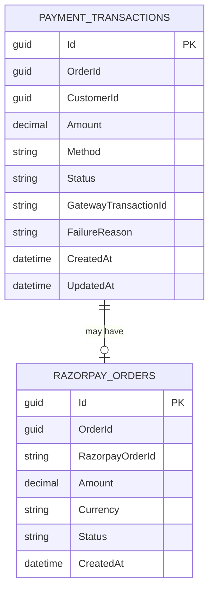
```mermaid
erDiagram
    PAYMENT_TRANSACTIONS {
        guid Id PK
        guid OrderId
        guid CustomerId
        decimal Amount
        string Method
        string Status
        string GatewayTransactionId
        string FailureReason
        datetime CreatedAt
        datetime UpdatedAt
    }

    RAZORPAY_ORDERS {
        guid Id PK
        guid OrderId
        string RazorpayOrderId
        decimal Amount
        string Currency
        string Status
        datetime CreatedAt
    }

    PAYMENT_TRANSACTIONS ||--o| RAZORPAY_ORDERS : "may have"
```

**Tables:** 2 | **Key relationships:** PaymentTransaction → RazorpayOrder (1:0..1)

**Notes:**
- `OrderId` references OrderService Orders — no FK constraint (cross-service)
- `Method` is an enum string: `COD`, `Card`, `Wallet`, `Razorpay`
- `Status` lifecycle: `Pending → Success | Failed | Refunded`
- `GatewayTransactionId` stores the external payment gateway reference
- `RAZORPAY_ORDERS` is only created when payment method is Razorpay

---

### 6.5 Admin Service Database — `FoodDelivery_AdminDb`

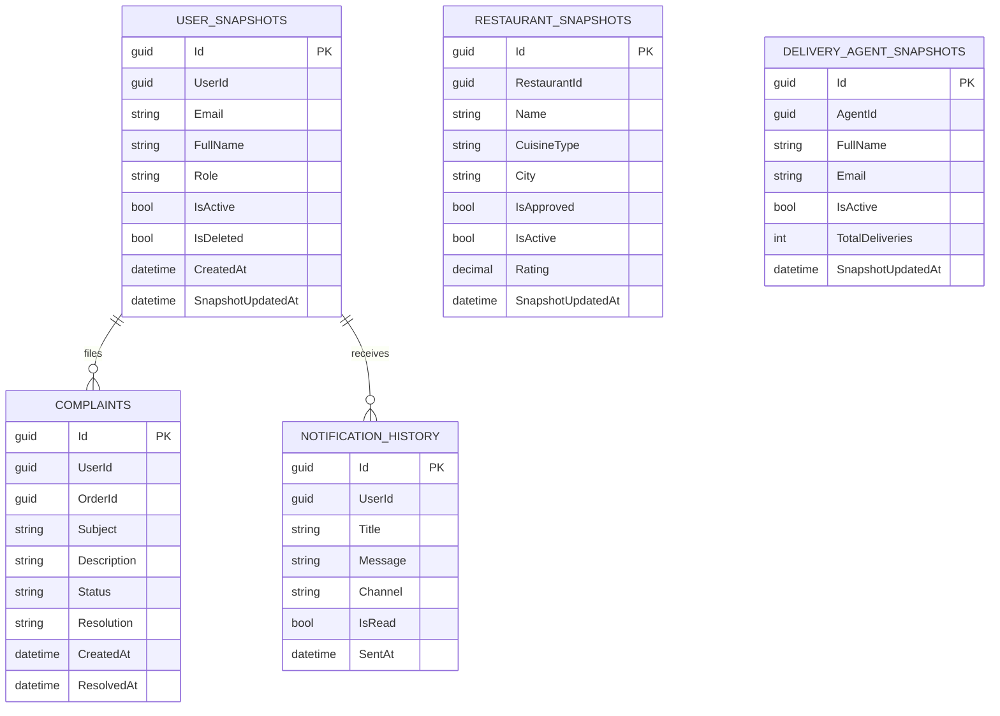
```mermaid
erDiagram
    USER_SNAPSHOTS {
        guid Id PK
        guid UserId
        string Email
        string FullName
        string Role
        bool IsActive
        bool IsDeleted
        datetime CreatedAt
        datetime SnapshotUpdatedAt
    }

    RESTAURANT_SNAPSHOTS {
        guid Id PK
        guid RestaurantId
        string Name
        string CuisineType
        string City
        bool IsApproved
        bool IsActive
        decimal Rating
        datetime SnapshotUpdatedAt
    }

    DELIVERY_AGENT_SNAPSHOTS {
        guid Id PK
        guid AgentId
        string FullName
        string Email
        bool IsActive
        int TotalDeliveries
        datetime SnapshotUpdatedAt
    }

    COMPLAINTS {
        guid Id PK
        guid UserId
        guid OrderId
        string Subject
        string Description
        string Status
        string Resolution
        datetime CreatedAt
        datetime ResolvedAt
    }

    NOTIFICATION_HISTORY {
        guid Id PK
        guid UserId
        string Title
        string Message
        string Channel
        bool IsRead
        datetime SentAt
    }

    USER_SNAPSHOTS ||--o{ COMPLAINTS : "files"
    USER_SNAPSHOTS ||--o{ NOTIFICATION_HISTORY : "receives"
```

**Tables:** 5 | **Key relationships:** UserSnapshot → Complaints (1:N), UserSnapshot → NotificationHistory (1:N)

**Notes:**
- All `*_SNAPSHOTS` tables are **read-only caches** of data from other services — updated via RabbitMQ events or periodic sync
- `UserId`, `RestaurantId`, `AgentId` are cross-service references — no FK constraints
- `COMPLAINTS` links a user to an order by ID only
- `NOTIFICATION_HISTORY` tracks all sent notifications for audit purposes
- `Channel` on NotificationHistory: `Email`, `SMS`, `InApp`

---

## 7. Class Diagrams

### Domain Entities - Auth Service

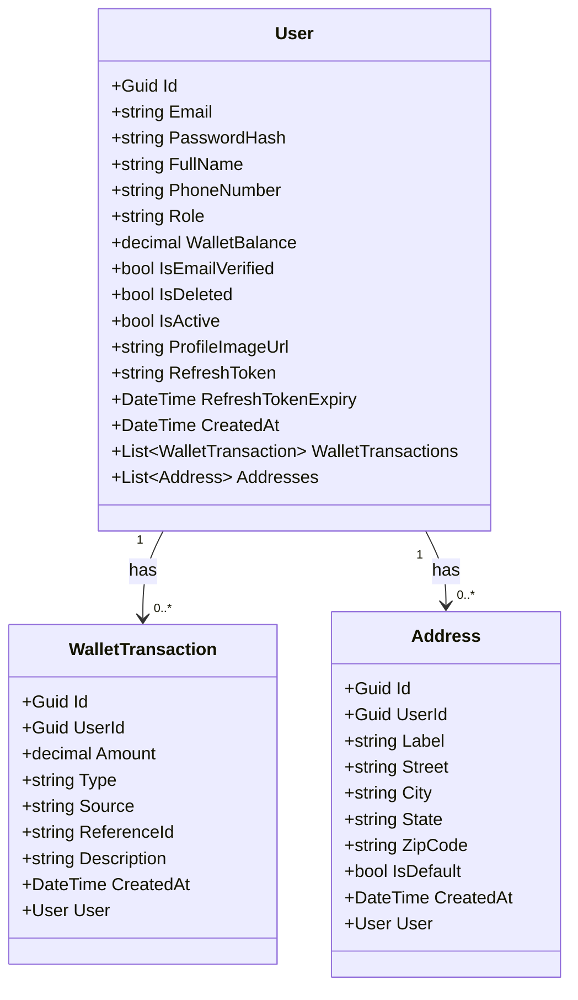
```mermaid
classDiagram
    class User {
        +Guid Id
        +string Email
        +string PasswordHash
        +string FullName
        +string PhoneNumber
        +string Role
        +decimal WalletBalance
        +bool IsEmailVerified
        +bool IsDeleted
        +bool IsActive
        +string ProfileImageUrl
        +string RefreshToken
        +DateTime RefreshTokenExpiry
        +DateTime CreatedAt
        +List~WalletTransaction~ WalletTransactions
        +List~Address~ Addresses
    }

    class WalletTransaction {
        +Guid Id
        +Guid UserId
        +decimal Amount
        +string Type
        +string Source
        +string ReferenceId
        +string Description
        +DateTime CreatedAt
        +User User
    }

    class Address {
        +Guid Id
        +Guid UserId
        +string Label
        +string Street
        +string City
        +string State
        +string ZipCode
        +bool IsDefault
        +DateTime CreatedAt
        +User User
    }

    User "1" --> "0..*" WalletTransaction : has
    User "1" --> "0..*" Address : has
```

### Domain Entities - Catalog Service

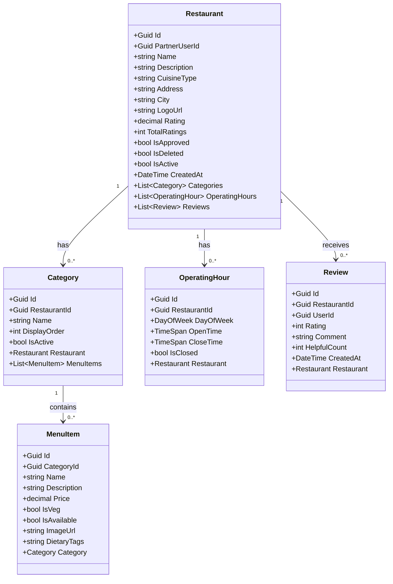
```mermaid
classDiagram
    class Restaurant {
        +Guid Id
        +Guid PartnerUserId
        +string Name
        +string Description
        +string CuisineType
        +string Address
        +string City
        +string LogoUrl
        +decimal Rating
        +int TotalRatings
        +bool IsApproved
        +bool IsDeleted
        +bool IsActive
        +DateTime CreatedAt
        +List~Category~ Categories
        +List~OperatingHour~ OperatingHours
        +List~Review~ Reviews
    }

    class Category {
        +Guid Id
        +Guid RestaurantId
        +string Name
        +int DisplayOrder
        +bool IsActive
        +Restaurant Restaurant
        +List~MenuItem~ MenuItems
    }

    class MenuItem {
        +Guid Id
        +Guid CategoryId
        +string Name
        +string Description
        +decimal Price
        +bool IsVeg
        +bool IsAvailable
        +string ImageUrl
        +string DietaryTags
        +Category Category
    }

    class OperatingHour {
        +Guid Id
        +Guid RestaurantId
        +DayOfWeek DayOfWeek
        +TimeSpan OpenTime
        +TimeSpan CloseTime
        +bool IsClosed
        +Restaurant Restaurant
    }

    class Review {
        +Guid Id
        +Guid RestaurantId
        +Guid UserId
        +int Rating
        +string Comment
        +int HelpfulCount
        +DateTime CreatedAt
        +Restaurant Restaurant
    }

    Restaurant "1" --> "0..*" Category : has
    Category "1" --> "0..*" MenuItem : contains
    Restaurant "1" --> "0..*" OperatingHour : has
    Restaurant "1" --> "0..*" Review : receives
```

### Domain Entities - Order Service

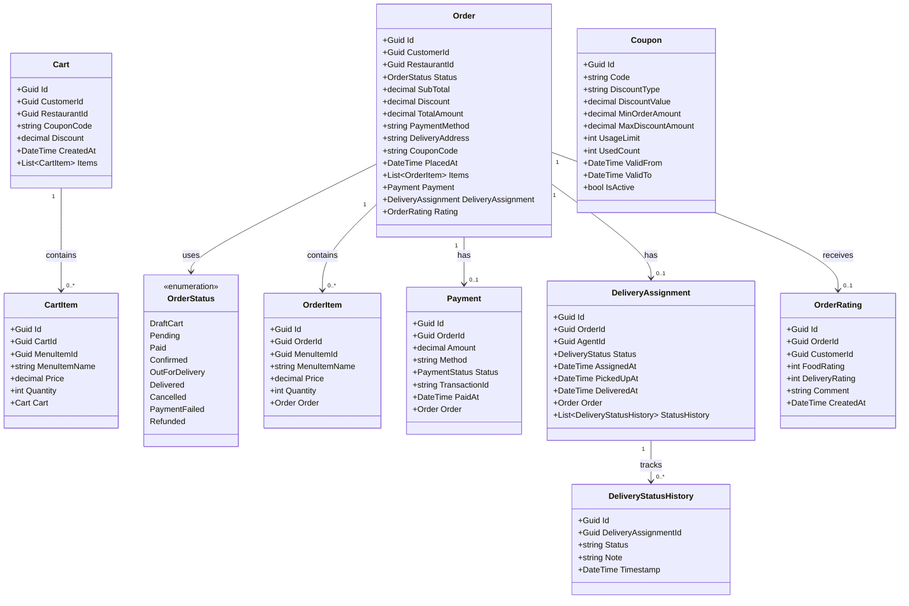
```mermaid
classDiagram
    class Cart {
        +Guid Id
        +Guid CustomerId
        +Guid RestaurantId
        +string CouponCode
        +decimal Discount
        +DateTime CreatedAt
        +List~CartItem~ Items
    }

    class CartItem {
        +Guid Id
        +Guid CartId
        +Guid MenuItemId
        +string MenuItemName
        +decimal Price
        +int Quantity
        +Cart Cart
    }

    class Order {
        +Guid Id
        +Guid CustomerId
        +Guid RestaurantId
        +OrderStatus Status
        +decimal SubTotal
        +decimal Discount
        +decimal TotalAmount
        +string PaymentMethod
        +string DeliveryAddress
        +string CouponCode
        +DateTime PlacedAt
        +List~OrderItem~ Items
        +Payment Payment
        +DeliveryAssignment DeliveryAssignment
        +OrderRating Rating
    }

    class OrderStatus {
        <<enumeration>>
        DraftCart
        Pending
        Paid
        Confirmed
        OutForDelivery
        Delivered
        Cancelled
        PaymentFailed
        Refunded
    }

    class OrderItem {
        +Guid Id
        +Guid OrderId
        +Guid MenuItemId
        +string MenuItemName
        +decimal Price
        +int Quantity
        +Order Order
    }

    class Payment {
        +Guid Id
        +Guid OrderId
        +decimal Amount
        +string Method
        +PaymentStatus Status
        +string TransactionId
        +DateTime PaidAt
        +Order Order
    }

    class DeliveryAssignment {
        +Guid Id
        +Guid OrderId
        +Guid AgentId
        +DeliveryStatus Status
        +DateTime AssignedAt
        +DateTime PickedUpAt
        +DateTime DeliveredAt
        +Order Order
        +List~DeliveryStatusHistory~ StatusHistory
    }

    class DeliveryStatusHistory {
        +Guid Id
        +Guid DeliveryAssignmentId
        +string Status
        +string Note
        +DateTime Timestamp
    }

    class OrderRating {
        +Guid Id
        +Guid OrderId
        +Guid CustomerId
        +int FoodRating
        +int DeliveryRating
        +string Comment
        +DateTime CreatedAt
    }

    class Coupon {
        +Guid Id
        +string Code
        +string DiscountType
        +decimal DiscountValue
        +decimal MinOrderAmount
        +decimal MaxDiscountAmount
        +int UsageLimit
        +int UsedCount
        +DateTime ValidFrom
        +DateTime ValidTo
        +bool IsActive
    }

    Cart "1" --> "0..*" CartItem : contains
    Order "1" --> "0..*" OrderItem : contains
    Order "1" --> "0..1" Payment : has
    Order "1" --> "0..1" DeliveryAssignment : has
    Order "1" --> "0..1" OrderRating : receives
    DeliveryAssignment "1" --> "0..*" DeliveryStatusHistory : tracks
    Order --> OrderStatus : uses
```

### Service Layer - Application Services

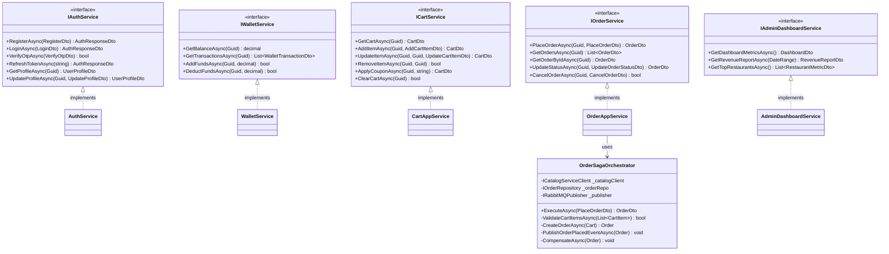
```mermaid
classDiagram
    class IAuthService {
        <<interface>>
        +RegisterAsync(RegisterDto) AuthResponseDto
        +LoginAsync(LoginDto) AuthResponseDto
        +VerifyOtpAsync(VerifyOtpDto) bool
        +RefreshTokenAsync(string) AuthResponseDto
        +GetProfileAsync(Guid) UserProfileDto
        +UpdateProfileAsync(Guid, UpdateProfileDto) UserProfileDto
    }

    class IWalletService {
        <<interface>>
        +GetBalanceAsync(Guid) decimal
        +GetTransactionsAsync(Guid) List~WalletTransactionDto~
        +AddFundsAsync(Guid, decimal) bool
        +DeductFundsAsync(Guid, decimal) bool
    }

    class ICartService {
        <<interface>>
        +GetCartAsync(Guid) CartDto
        +AddItemAsync(Guid, AddCartItemDto) CartDto
        +UpdateItemAsync(Guid, Guid, UpdateCartItemDto) CartDto
        +RemoveItemAsync(Guid, Guid) bool
        +ApplyCouponAsync(Guid, string) CartDto
        +ClearCartAsync(Guid) bool
    }

    class IOrderService {
        <<interface>>
        +PlaceOrderAsync(Guid, PlaceOrderDto) OrderDto
        +GetOrdersAsync(Guid) List~OrderDto~
        +GetOrderByIdAsync(Guid) OrderDto
        +UpdateStatusAsync(Guid, UpdateOrderStatusDto) OrderDto
        +CancelOrderAsync(Guid, CancelOrderDto) bool
    }

    class OrderSagaOrchestrator {
        -ICatalogServiceClient _catalogClient
        -IOrderRepository _orderRepo
        -IRabbitMQPublisher _publisher
        +ExecuteAsync(PlaceOrderDto) OrderDto
        -ValidateCartItemsAsync(List~CartItem~) bool
        -CreateOrderAsync(Cart) Order
        -PublishOrderPlacedEventAsync(Order) void
        -CompensateAsync(Order) void
    }

    class IAdminDashboardService {
        <<interface>>
        +GetDashboardMetricsAsync() DashboardDto
        +GetRevenueReportAsync(DateRange) RevenueReportDto
        +GetTopRestaurantsAsync() List~RestaurantMetricDto~
    }

    IAuthService <|.. AuthService : implements
    IWalletService <|.. WalletService : implements
    ICartService <|.. CartAppService : implements
    IOrderService <|.. OrderAppService : implements
    OrderAppService --> OrderSagaOrchestrator : uses
    IAdminDashboardService <|.. AdminDashboardService : implements
```

---

## 8. Sequence Diagrams

### Order Placement with Payment Flow

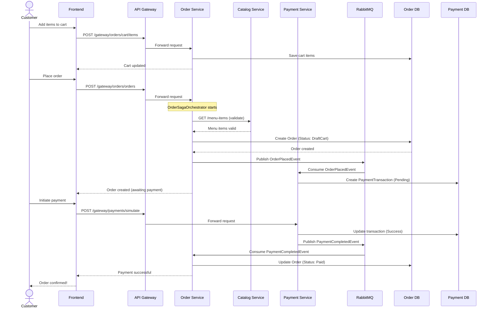
```mermaid
sequenceDiagram
    actor Customer
    participant Frontend
    participant Gateway as API Gateway
    participant OrderSvc as Order Service
    participant CatalogSvc as Catalog Service
    participant PaymentSvc as Payment Service
    participant RabbitMQ
    participant OrderDB as Order DB
    participant PaymentDB as Payment DB

    Customer->>Frontend: Add items to cart
    Frontend->>Gateway: POST /gateway/orders/cart/items
    Gateway->>OrderSvc: Forward request
    OrderSvc->>OrderDB: Save cart items
    OrderSvc-->>Frontend: Cart updated

    Customer->>Frontend: Place order
    Frontend->>Gateway: POST /gateway/orders/orders
    Gateway->>OrderSvc: Forward request
    
    Note over OrderSvc: OrderSagaOrchestrator starts
    
    OrderSvc->>CatalogSvc: GET /menu-items (validate)
    CatalogSvc-->>OrderSvc: Menu items valid
    
    OrderSvc->>OrderDB: Create Order (Status: DraftCart)
    OrderDB-->>OrderSvc: Order created
    
    OrderSvc->>RabbitMQ: Publish OrderPlacedEvent
    RabbitMQ->>PaymentSvc: Consume OrderPlacedEvent
    PaymentSvc->>PaymentDB: Create PaymentTransaction (Pending)
    
    OrderSvc-->>Frontend: Order created (awaiting payment)
    
    Customer->>Frontend: Initiate payment
    Frontend->>Gateway: POST /gateway/payments/simulate
    Gateway->>PaymentSvc: Forward request
    PaymentSvc->>PaymentDB: Update transaction (Success)
    PaymentSvc->>RabbitMQ: Publish PaymentCompletedEvent
    
    RabbitMQ->>OrderSvc: Consume PaymentCompletedEvent
    OrderSvc->>OrderDB: Update Order (Status: Paid)
    OrderSvc-->>Frontend: Payment successful
    
    Frontend-->>Customer: Order confirmed!
```

### Restaurant Approval Flow

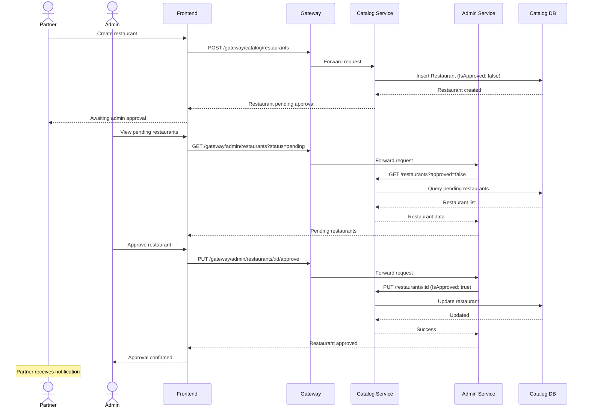
```mermaid
sequenceDiagram
    actor Partner
    actor Admin
    participant Frontend
    participant Gateway
    participant CatalogSvc as Catalog Service
    participant AdminSvc as Admin Service
    participant CatalogDB as Catalog DB

    Partner->>Frontend: Create restaurant
    Frontend->>Gateway: POST /gateway/catalog/restaurants
    Gateway->>CatalogSvc: Forward request
    CatalogSvc->>CatalogDB: Insert Restaurant (IsApproved: false)
    CatalogDB-->>CatalogSvc: Restaurant created
    CatalogSvc-->>Frontend: Restaurant pending approval
    Frontend-->>Partner: Awaiting admin approval

    Admin->>Frontend: View pending restaurants
    Frontend->>Gateway: GET /gateway/admin/restaurants?status=pending
    Gateway->>AdminSvc: Forward request
    AdminSvc->>CatalogSvc: GET /restaurants?approved=false
    CatalogSvc->>CatalogDB: Query pending restaurants
    CatalogDB-->>CatalogSvc: Restaurant list
    CatalogSvc-->>AdminSvc: Restaurant data
    AdminSvc-->>Frontend: Pending restaurants

    Admin->>Frontend: Approve restaurant
    Frontend->>Gateway: PUT /gateway/admin/restaurants/:id/approve
    Gateway->>AdminSvc: Forward request
    AdminSvc->>CatalogSvc: PUT /restaurants/:id (IsApproved: true)
    CatalogSvc->>CatalogDB: Update restaurant
    CatalogDB-->>CatalogSvc: Updated
    CatalogSvc-->>AdminSvc: Success
    AdminSvc-->>Frontend: Restaurant approved
    Frontend-->>Admin: Approval confirmed

    Note over Partner: Partner receives notification
```

### Delivery Assignment & Tracking Flow

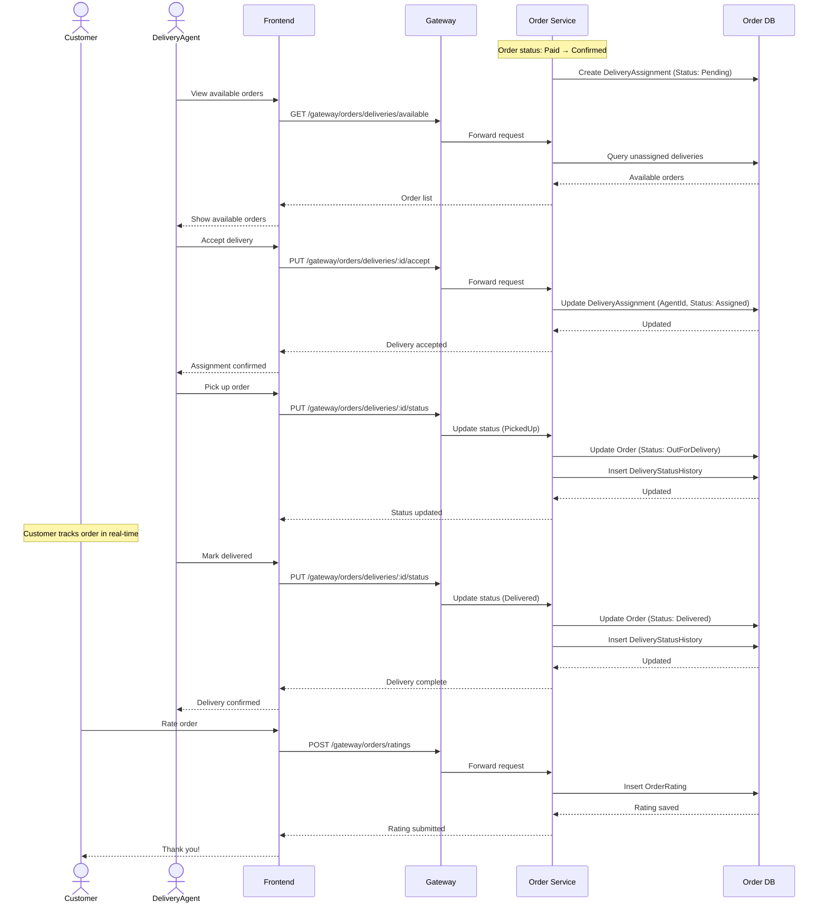
```mermaid
sequenceDiagram
    actor Customer
    actor DeliveryAgent
    participant Frontend
    participant Gateway
    participant OrderSvc as Order Service
    participant OrderDB as Order DB

    Note over OrderSvc: Order status: Paid → Confirmed

    OrderSvc->>OrderDB: Create DeliveryAssignment (Status: Pending)
    
    DeliveryAgent->>Frontend: View available orders
    Frontend->>Gateway: GET /gateway/orders/deliveries/available
    Gateway->>OrderSvc: Forward request
    OrderSvc->>OrderDB: Query unassigned deliveries
    OrderDB-->>OrderSvc: Available orders
    OrderSvc-->>Frontend: Order list
    Frontend-->>DeliveryAgent: Show available orders

    DeliveryAgent->>Frontend: Accept delivery
    Frontend->>Gateway: PUT /gateway/orders/deliveries/:id/accept
    Gateway->>OrderSvc: Forward request
    OrderSvc->>OrderDB: Update DeliveryAssignment (AgentId, Status: Assigned)
    OrderDB-->>OrderSvc: Updated
    OrderSvc-->>Frontend: Delivery accepted
    Frontend-->>DeliveryAgent: Assignment confirmed

    DeliveryAgent->>Frontend: Pick up order
    Frontend->>Gateway: PUT /gateway/orders/deliveries/:id/status
    Gateway->>OrderSvc: Update status (PickedUp)
    OrderSvc->>OrderDB: Update Order (Status: OutForDelivery)
    OrderSvc->>OrderDB: Insert DeliveryStatusHistory
    OrderDB-->>OrderSvc: Updated
    OrderSvc-->>Frontend: Status updated

    Note over Customer: Customer tracks order in real-time

    DeliveryAgent->>Frontend: Mark delivered
    Frontend->>Gateway: PUT /gateway/orders/deliveries/:id/status
    Gateway->>OrderSvc: Update status (Delivered)
    OrderSvc->>OrderDB: Update Order (Status: Delivered)
    OrderSvc->>OrderDB: Insert DeliveryStatusHistory
    OrderDB-->>OrderSvc: Updated
    OrderSvc-->>Frontend: Delivery complete
    Frontend-->>DeliveryAgent: Delivery confirmed

    Customer->>Frontend: Rate order
    Frontend->>Gateway: POST /gateway/orders/ratings
    Gateway->>OrderSvc: Forward request
    OrderSvc->>OrderDB: Insert OrderRating
    OrderDB-->>OrderSvc: Rating saved
    OrderSvc-->>Frontend: Rating submitted
    Frontend-->>Customer: Thank you!
```

### JWT Authentication Flow

```mermaid
sequenceDiagram
    actor User
    participant Frontend
    participant Gateway
    participant AuthSvc as Auth Service
    participant AuthDB as Auth DB

    User->>Frontend: Enter credentials
    Frontend->>Gateway: POST /gateway/auth/login
    Gateway->>AuthSvc: Forward request
    AuthSvc->>AuthDB: Query user by email
    AuthDB-->>AuthSvc: User record
    AuthSvc->>AuthSvc: Verify password hash
    
    alt Password valid
        AuthSvc->>AuthSvc: Generate JWT (60 min expiry)
        AuthSvc->>AuthSvc: Generate Refresh Token
        AuthSvc->>AuthDB: Store refresh token
        AuthSvc-->>Gateway: AuthResponseDto (JWT + Refresh)
        Gateway-->>Frontend: Tokens
        Frontend->>Frontend: Store tokens in localStorage
        Frontend-->>User: Login successful
    else Password invalid
        AuthSvc-->>Gateway: 401 Unauthorized
        Gateway-->>Frontend: Error
        Frontend-->>User: Invalid credentials
    end

    Note over Frontend: User makes authenticated request

    Frontend->>Gateway: GET /gateway/orders/orders<br/>Authorization: Bearer {JWT}
    Gateway->>Gateway: Validate JWT signature
    Gateway->>Gateway: Check expiry
    
    alt Token valid
        Gateway->>OrderSvc: Forward with user claims
        OrderSvc-->>Gateway: Order data
        Gateway-->>Frontend: Response
    else Token expired
        Gateway-->>Frontend: 401 Unauthorized
        Frontend->>Gateway: POST /gateway/auth/refresh<br/>{refreshToken}
        Gateway->>AuthSvc: Forward request
        AuthSvc->>AuthDB: Validate refresh token
        AuthDB-->>AuthSvc: Token valid
        AuthSvc->>AuthSvc: Generate new JWT
        AuthSvc-->>Frontend: New JWT
        Frontend->>Frontend: Update stored token
        Frontend->>Gateway: Retry original request
        Gateway->>OrderSvc: Forward request
        OrderSvc-->>Frontend: Order data
    end
```

---

## 9. Event Flow Diagram

### RabbitMQ Event-Driven Communication

```mermaid
graph LR
    subgraph Publishers
        OrderSvc["Order Service"]
        PaymentSvc["Payment Service"]
        AuthSvc["Auth Service"]
    end

    subgraph RabbitMQ["RabbitMQ Message Broker"]
        Q1["order-placed<br/>Queue"]
        Q2["payment-completed-order<br/>Queue"]
        Q3["payment-failed-order<br/>Queue"]
        Q4["user-registered<br/>Queue"]
    end

    subgraph Consumers
        PaymentSvc2["Payment Service"]
        OrderSvc2["Order Service"]
        AdminSvc["Admin Service"]
    end

    OrderSvc -->|OrderPlacedEvent| Q1
    Q1 -->|Consume| PaymentSvc2

    PaymentSvc -->|PaymentCompletedEvent| Q2
    Q2 -->|Consume| OrderSvc2

    PaymentSvc -->|PaymentFailedEvent| Q3
    Q3 -->|Consume| OrderSvc2

    AuthSvc -->|UserRegisteredEvent| Q4
    Q4 -->|Consume| AdminSvc

    style Q1 fill:#ffeb3b
    style Q2 fill:#4caf50
    style Q3 fill:#f44336
    style Q4 fill:#2196f3
```

### Event Payload Examples

**OrderPlacedEvent**
```json
{
  "orderId": "guid",
  "customerId": "guid",
  "restaurantId": "guid",
  "totalAmount": 450.00,
  "paymentMethod": "Razorpay",
  "timestamp": "2026-05-06T10:30:00Z"
}
```

**PaymentCompletedEvent**
```json
{
  "orderId": "guid",
  "transactionId": "guid",
  "amount": 450.00,
  "method": "Razorpay",
  "gatewayTransactionId": "pay_xyz123",
  "timestamp": "2026-05-06T10:31:00Z"
}
```

**PaymentFailedEvent**
```json
{
  "orderId": "guid",
  "transactionId": "guid",
  "amount": 450.00,
  "failureReason": "Insufficient funds",
  "timestamp": "2026-05-06T10:31:00Z"
}
```

---

## 10. Frontend Architecture

### React Component Hierarchy

```mermaid
graph TB
    App["App.jsx<br/>Router + Context Providers"]
    
    subgraph Contexts
        AuthCtx["AuthContext<br/>User state · Login/Logout"]
        CartCtx["CartContext<br/>Cart state · Add/Remove items"]
    end

    subgraph Layout
        Navbar["Navbar<br/>Role-based navigation"]
        Footer["Footer"]
    end

    subgraph CustomerPages
        HomePage["HomePage<br/>Restaurant listing"]
        RestDetail["RestaurantDetailPage<br/>Menu display"]
        CartPage["CartPage<br/>Cart summary"]
        CheckoutPage["CheckoutPage<br/>Order placement"]
        MyOrders["MyOrdersPage<br/>Order history"]
        OrderDetail["OrderDetailPage<br/>Order tracking"]
        WalletPage["WalletPage<br/>Wallet management"]
    end

    subgraph PartnerPages
        PartnerDash["PartnerDashboard<br/>Metrics"]
        RestForm["RestaurantForm<br/>Create/Edit restaurant"]
        MenuMgmt["MenuManagement<br/>Menu CRUD"]
        OrdersMgmt["OrdersManagement<br/>Incoming orders"]
        CouponMgmt["CouponsManagement<br/>Coupon CRUD"]
    end

    subgraph AdminPages
        AdminDash["AdminDashboard<br/>Platform metrics"]
        UsersMgmt["UsersManagement<br/>User CRUD"]
        RestMgmt["RestaurantsManagement<br/>Approval workflow"]
        AdminOrders["OrdersManagement<br/>Override orders"]
        AgentMgmt["DeliveryAgentsManagement<br/>Agent CRUD"]
        Reports["ReportsPage<br/>Sales reports"]
        RefundMgmt["RefundManagementPage<br/>Refund processing"]
    end

    subgraph DeliveryPages
        DeliveryDash["DeliveryAgentDashboard<br/>Metrics"]
        MyDeliveries["MyDeliveriesPage<br/>Assigned deliveries"]
        AvailOrders["AvailableOrdersPage<br/>Accept orders"]
    end

    subgraph Services
        ApiService["apiService.js<br/>Axios wrapper · Token refresh"]
    end

    subgraph Components
        ProtectedRoute["ProtectedRoute<br/>Role-based access"]
        ImageUpload["ImageUpload<br/>Cloudinary integration"]
    end

    App --> AuthCtx
    App --> CartCtx
    App --> Navbar
    App --> Footer
    App --> ProtectedRoute

    ProtectedRoute --> CustomerPages
    ProtectedRoute --> PartnerPages
    ProtectedRoute --> AdminPages
    ProtectedRoute --> DeliveryPages

    CustomerPages --> ApiService
    PartnerPages --> ApiService
    AdminPages --> ApiService
    DeliveryPages --> ApiService

    ApiService --> AuthCtx
```

### Frontend State Management

```mermaid
stateDiagram-v2
    [*] --> Unauthenticated
    
    Unauthenticated --> Authenticated: Login success
    Authenticated --> Unauthenticated: Logout
    
    state Authenticated {
        [*] --> CheckingRole
        CheckingRole --> CustomerView: Role = Customer
        CheckingRole --> PartnerView: Role = Partner
        CheckingRole --> AdminView: Role = Admin
        CheckingRole --> DeliveryView: Role = DeliveryAgent
        
        state CustomerView {
            [*] --> BrowsingRestaurants
            BrowsingRestaurants --> ViewingMenu: Select restaurant
            ViewingMenu --> CartManagement: Add to cart
            CartManagement --> Checkout: Proceed
            Checkout --> PaymentProcessing: Place order
            PaymentProcessing --> OrderTracking: Payment success
            OrderTracking --> RatingOrder: Delivered
            RatingOrder --> BrowsingRestaurants: Continue shopping
        }
        
        state PartnerView {
            [*] --> Dashboard
            Dashboard --> ManagingRestaurant: Edit profile
            Dashboard --> ManagingMenu: Edit menu
            Dashboard --> ViewingOrders: Check orders
            ViewingOrders --> UpdatingOrderStatus: Confirm order
        }
        
        state AdminView {
            [*] --> AdminDashboard
            AdminDashboard --> ApprovingRestaurants: Review pending
            AdminDashboard --> ManagingUsers: User management
            AdminDashboard --> ViewingReports: Generate reports
            AdminDashboard --> ProcessingRefunds: Handle refunds
        }
        
        state DeliveryView {
            [*] --> ViewingAvailable
            ViewingAvailable --> AcceptingDelivery: Accept order
            AcceptingDelivery --> TrackingDelivery: Pick up
            TrackingDelivery --> CompletingDelivery: Deliver
            CompletingDelivery --> ViewingAvailable: Next delivery
        }
    }
```

---

## 11. API Gateway Routing

### Ocelot Route Configuration

```mermaid
graph LR
    subgraph Client
        FE["React Frontend<br/>localhost:5173"]
    end

    subgraph Gateway["API Gateway - localhost:5000"]
        GW["Ocelot Gateway<br/>JWT Validation<br/>CORS<br/>Swagger UI"]
    end

    subgraph Services
        Auth["Auth Service<br/>localhost:5001"]
        Catalog["Catalog Service<br/>localhost:5002"]
        Order["Order Service<br/>localhost:5003"]
        Payment["Payment Service<br/>localhost:5004"]
        Admin["Admin Service<br/>localhost:5005"]
    end

    FE -->|"POST /gateway/auth/register"| GW
    FE -->|"POST /gateway/auth/login"| GW
    FE -->|"GET /gateway/catalog/restaurants"| GW
    FE -->|"POST /gateway/orders/cart/items"| GW
    FE -->|"POST /gateway/payments/simulate"| GW
    FE -->|"GET /gateway/admin/dashboard"| GW

    GW -->|"/api/auth/*"| Auth
    GW -->|"/api/catalog/*"| Catalog
    GW -->|"/api/orders/*"| Order
    GW -->|"/api/payments/*"| Payment
    GW -->|"/api/admin/*"| Admin
```

### Route Table

| Gateway Path | Upstream Service | Port | Auth Required |
|---|---|---|---|
| `/gateway/auth/register` | AuthService `/api/auth/register` | 5001 | No |
| `/gateway/auth/login` | AuthService `/api/auth/login` | 5001 | No |
| `/gateway/auth/refresh` | AuthService `/api/auth/refresh` | 5001 | No |
| `/gateway/auth/profile` | AuthService `/api/auth/profile` | 5001 | Yes |
| `/gateway/auth/addresses` | AuthService `/api/auth/addresses` | 5001 | Yes |
| `/gateway/auth/wallet/**` | AuthService `/api/auth/wallet/**` | 5001 | Yes |
| `/gateway/catalog/restaurants` | CatalogService `/api/restaurants` | 5002 | No |
| `/gateway/catalog/menu-items/**` | CatalogService `/api/menu-items/**` | 5002 | Partial |
| `/gateway/catalog/categories/**` | CatalogService `/api/categories/**` | 5002 | Partial |
| `/gateway/catalog/reviews/**` | CatalogService `/api/reviews/**` | 5002 | Partial |
| `/gateway/orders/cart/**` | OrderService `/api/cart/**` | 5003 | Yes |
| `/gateway/orders/orders/**` | OrderService `/api/orders/**` | 5003 | Yes |
| `/gateway/orders/deliveries/**` | OrderService `/api/deliveries/**` | 5003 | Yes |
| `/gateway/orders/ratings/**` | OrderService `/api/ratings/**` | 5003 | Yes |
| `/gateway/orders/coupons/**` | OrderService `/api/coupons/**` | 5003 | Yes |
| `/gateway/payments/**` | PaymentService `/api/payments/**` | 5004 | Yes |
| `/gateway/admin/**` | AdminService `/api/admin/**` | 5005 | Yes (Admin) |

---

## 12. Authentication & Authorization Flow

### Role-Based Access Control

```mermaid
graph TB
    subgraph Roles
        Customer["Customer Role"]
        Partner["Partner Role"]
        Admin["Admin Role"]
        Agent["DeliveryAgent Role"]
    end

    subgraph CustomerAccess["Customer Permissions"]
        C1["Browse restaurants"]
        C2["View menus"]
        C3["Manage cart"]
        C4["Place orders"]
        C5["Track deliveries"]
        C6["Rate orders"]
        C7["Manage wallet"]
        C8["Manage addresses"]
    end

    subgraph PartnerAccess["Partner Permissions"]
        P1["Create/edit restaurant"]
        P2["Manage menu items"]
        P3["Manage categories"]
        P4["Set operating hours"]
        P5["View incoming orders"]
        P6["Confirm/reject orders"]
        P7["Create coupons"]
    end

    subgraph AdminAccess["Admin Permissions"]
        A1["View dashboard metrics"]
        A2["Approve/reject restaurants"]
        A3["Manage all users"]
        A4["Override order status"]
        A5["Process refunds"]
        A6["View reports"]
        A7["Handle complaints"]
        A8["Manage delivery agents"]
    end

    subgraph AgentAccess["Delivery Agent Permissions"]
        D1["View available orders"]
        D2["Accept deliveries"]
        D3["Update delivery status"]
        D4["View delivery history"]
    end

    Customer --> CustomerAccess
    Partner --> PartnerAccess
    Admin --> AdminAccess
    Agent --> AgentAccess
```

### JWT Token Structure

```mermaid
graph LR
    subgraph JWT["JWT Token"]
        Header["Header\nalg: HS256\ntyp: JWT"]
        Payload["Payload\nsub: userId\nemail: user@email.com\nrole: Customer\niss: FoodDelivery.AuthService\naud: FoodDelivery.Clients\nexp: +60 minutes"]
        Signature["Signature\nHMAC-SHA256\nSecret Key"]
    end

    Header --> Payload --> Signature
```

---

## Summary

This FoodDelivery platform implements a production-grade microservices architecture with:

- **5 independent microservices** each with their own database (Database-per-Service pattern)
- **Ocelot API Gateway** as the single entry point with JWT validation and Swagger aggregation
- **Event-driven communication** via RabbitMQ for async operations (payment flow, user registration)
- **Saga pattern** in OrderService for distributed transaction management
- **HTTP client communication** between services for synchronous data validation
- **Role-based access control** with 4 distinct user roles
- **React SPA** with context-based state management and automatic JWT refresh
- **Cloudinary** for image storage, **Razorpay** for payment processing, **Gmail SMTP** for notifications
- **Soft delete** pattern across entities for data integrity
- **EF Core** with SQL Server and separate databases per service for true data isolation

