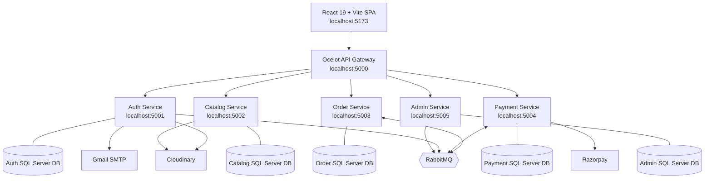
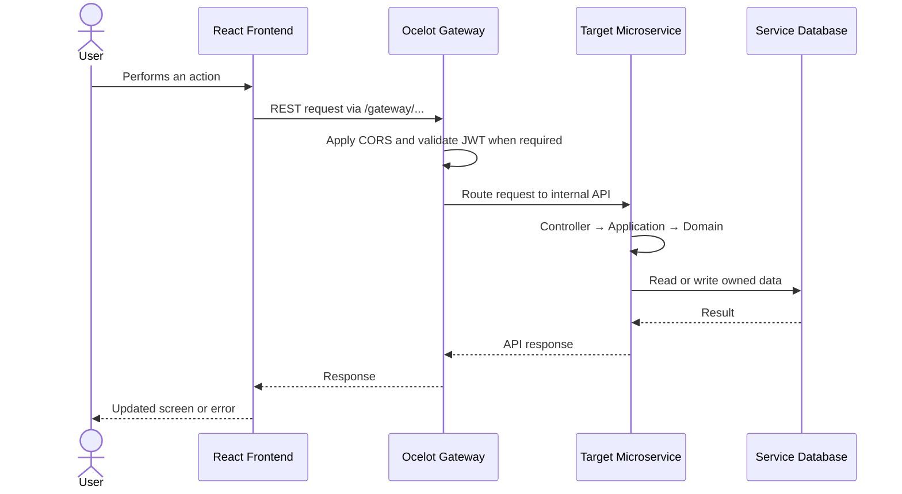

# FoodDelivery Sprint

A full-stack food delivery platform built with **C#/.NET microservices**, an **Ocelot API Gateway**, **RabbitMQ**, **SQL Server**, and a **React/Vite frontend**.

The platform supports customers, restaurant partners, delivery agents, and administrators across the complete food ordering lifecycle: authentication, restaurant discovery, menu management, cart and checkout, payments, delivery tracking, reviews, refunds, and administration.

## Contents

- [Project Highlights](#project-highlights)
- [Architecture](#architecture)
- [Microservices](#microservices)
- [Technology Stack](#technology-stack)
- [Repository Structure](#repository-structure)
- [Request and Event Flow](#request-and-event-flow)
- [Business Workflows](#business-workflows)
- [Prerequisites](#prerequisites)
- [Configuration](#configuration)
- [Execution](#execution)
- [API and Swagger](#api-and-swagger)
- [Testing](#testing)
- [Security and Reliability](#security-and-reliability)
- [Documentation](#documentation)
- [Known Limitations](#known-limitations)

## Project Highlights

- Five independently deployable backend microservices.
- Database-per-service approach using SQL Server and Entity Framework Core.
- Ocelot gateway as the single frontend entry point.
- JWT authentication and role-based authorization.
- RabbitMQ events for payment, order, and user-registration integration.
- Saga-style orchestration for order placement and compensation paths.
- React single-page application with role-based navigation.
- Cloudinary integration for image uploads.
- Razorpay integration/stub for online payment flows.
- Wallet payments, COD, refunds, coupons, ratings, and delivery status tracking.
- NUnit/Moq backend unit tests and Vitest/React Testing Library frontend tests.

## Architecture



### Architectural principles

1. **API Gateway pattern** – the frontend communicates through Ocelot rather than calling internal services directly.
2. **Database per service** – each service owns its data and migrations; cross-service relationships use identifiers rather than database foreign keys.
3. **Layered service design** – each backend service is separated into API, Application, Domain, and Infrastructure projects.
4. **Synchronous communication where immediate validation is needed** – for example, Order Service calls Catalog Service to validate menu items.
5. **Asynchronous communication for integration events** – RabbitMQ decouples order, payment, authentication, and administration workflows.
6. **Saga coordination** – order placement coordinates multiple operations without requiring a distributed database transaction.

## Microservices

| Component | Port | Responsibility |
|---|---:|---|
| **FoodDelivery.Gateway** | `5000` | Ocelot routing, CORS, JWT validation, Swagger aggregation |
| **AuthService** | `5001` | Registration, login, OTP, JWT/refresh tokens, profiles, addresses, wallets |
| **CatalogService** | `5002` | Restaurants, categories, menu items, availability, hours, reviews |
| **OrderService** | `5003` | Cart, coupons, orders, delivery assignments, status history, ratings |
| **PaymentService** | `5004` | Payment simulation, Razorpay flow, transactions, payment events, refunds |
| **AdminService** | `5005` | Dashboards, approvals, users, delivery agents, complaints, notifications, refund administration |
| **Frontend** | `5173` | React user interface for all supported roles |

Each backend service follows this general structure:

```text
<Service>.API            HTTP controllers, middleware, Swagger, startup
<Service>.Application    Use cases, DTOs, interfaces, business services
<Service>.Domain         Entities, enums, domain rules
<Service>.Infrastructure Repositories, EF Core, external clients, messaging
<Service>.Tests          NUnit unit tests for application-layer behavior
```

### User roles

- **Customer:** browse restaurants, manage cart, place and track orders, pay, use wallet, rate orders.
- **Partner:** manage restaurant details, categories, menu items, operating hours, coupons, and incoming orders.
- **DeliveryAgent:** view available deliveries, accept assignments, and update delivery status.
- **Admin:** approve restaurants, manage users and agents, view reports, handle complaints, and process refunds.

## Technology Stack

### Backend

- C# and ASP.NET Core on .NET 10
- Entity Framework Core
- SQL Server
- Ocelot API Gateway
- RabbitMQ
- JWT Bearer authentication
- BCrypt password hashing
- Swagger/OpenAPI

### Frontend

- React 19
- Vite
- React Router
- Axios
- React Context for authentication and cart state
- Tailwind CSS and component/icon libraries
- Vitest, jsdom, and React Testing Library

### External integrations

- Cloudinary for restaurant, menu, and profile images
- Razorpay test/stub integration for online payment
- Gmail SMTP for email notifications and OTP-related flows

## Repository Structure

```text
FoodDelivery/
├── Backend/
│   ├── Gateway/FoodDelivery.Gateway/
│   ├── Services/
│   │   ├── AuthService/
│   │   ├── CatalogService/
│   │   ├── OrderService/
│   │   ├── PaymentService/
│   │   └── AdminService/
│   └── Shared/FoodDelivery.Shared/
├── Frontend/
│   ├── src/components/
│   ├── src/context/
│   ├── src/pages/
│   ├── src/services/
│   └── package.json
├── FoodDelivery.slnx
├── PROJECT_ARCHITECTURE.md
├── TESTING_GUIDE.md
├── testing_implementation.md
└── README.md
```

## Request and Event Flow

### Standard request flow



### Order and payment event flow

```mermaid
flowchart LR
    A[Customer places order] --> B[Order Service validates cart]
    B --> C[Order record created]
    C --> D[OrderPlacedEvent]
    D --> E[RabbitMQ]
    E --> F[Payment Service creates pending transaction]
    F --> G[Payment succeeds or fails]
    G --> H[PaymentCompletedEvent or PaymentFailedEvent]
    H --> I[RabbitMQ]
    I --> J[Order Service updates order status]
    J --> K[Restaurant and delivery workflow]
```



Important event integrations include:

| Event | Publisher | Consumer | Purpose |
|---|---|---|---|
| `OrderPlacedEvent` | Order Service | Payment Service | Create a pending payment transaction |
| `PaymentCompletedEvent` | Payment Service | Order Service | Move an order to paid state |
| `PaymentFailedEvent` | Payment Service | Order Service | Mark payment/order failure and enable compensation handling |
| `UserRegisteredEvent` | Auth Service | Admin Service | Create or update an administrative user snapshot |

## Business Workflows

### Customer order workflow

1. Customer registers or logs in and receives a JWT.
2. Customer browses approved restaurants and menu items.
3. Customer adds items to a cart and optionally applies a coupon.
4. Order Service validates item information with Catalog Service.
5. The order is created and an `OrderPlacedEvent` is published.
6. Payment is completed through wallet, COD, payment simulation, or Razorpay flow.
7. Payment Service publishes a success or failure event.
8. Order Service updates the order status.
9. The restaurant confirms the order.
10. A delivery agent accepts, picks up, and delivers the order.
11. The customer can submit food and delivery ratings.

Typical order states include `DraftCart`, `Pending`, `Paid`, `Confirmed`, `OutForDelivery`, `Delivered`, `Cancelled`, `PaymentFailed`, and `Refunded`.

### Partner onboarding workflow

1. A partner registers an account.
2. The partner creates a restaurant profile, menu categories, menu items, and operating hours.
3. The restaurant remains pending until an administrator approves it.
4. Approved restaurants become visible to customers.
5. Partners manage menus, availability, orders, and coupons from the partner area.

### Cancellation and refund workflow

1. A customer cancels an eligible paid order.
2. The system creates a refund request according to the configured refund rules.
3. An administrator reviews the request.
4. The administrator approves or rejects the request.
5. Approved refunds are credited to the customer wallet and recorded in wallet history.
6. COD cancellations do not create a refund for an unpaid transaction.

## Prerequisites

Install the following before running the complete platform:

- .NET 10 SDK
- Node.js and npm
- SQL Server or SQL Server Express
- RabbitMQ
- Git
- Optional: Docker Desktop for local infrastructure
- Optional: Cloudinary, Razorpay test credentials, and Gmail SMTP credentials for integrations

Confirm the SDKs are available:

```bash
dotnet --version
node --version
npm --version
```

## Configuration

Before starting the services:

1. Review `appsettings.json` and `appsettings.Development.json` in each API project.
2. Set SQL Server connection strings for each service database.
3. Configure RabbitMQ host, port, username, password, exchange, and queue settings.
4. Configure Cloudinary, Razorpay, and SMTP settings when those features are enabled.
5. Ensure the gateway JWT issuer, audience, and signing configuration match Auth Service.
6. Apply the required EF Core migrations or database scripts, including the Catalog Service migration scripts where applicable.

Do not commit passwords, API keys, JWT signing keys, or production connection strings. Use user secrets, environment variables, or a local development configuration that is excluded from source control.

## Execution

Run the following from the repository root.

### Restore and build the backend

```bash
dotnet restore FoodDelivery.slnx
dotnet build FoodDelivery.slnx
```

### Start backend services

Run each project in a separate terminal. Start the service APIs before starting the gateway.

```bash
dotnet run --project Backend/Services/AuthService/AuthService.API/AuthService.API.csproj --launch-profile http
dotnet run --project Backend/Services/CatalogService/CatalogService.API/CatalogService.API.csproj --launch-profile http
dotnet run --project Backend/Services/OrderService/OrderService.API/OrderService.API.csproj --launch-profile http
dotnet run --project Backend/Services/PaymentService/PaymentService.API/PaymentService.API.csproj --launch-profile http
dotnet run --project Backend/Services/AdminService/AdminService.API/AdminService.API.csproj --launch-profile http
dotnet run --project Backend/Gateway/FoodDelivery.Gateway/FoodDelivery.Gateway.csproj --launch-profile http
```

### Start the frontend

```bash
cd Frontend
npm install
npm run dev
```

Open the Vite URL shown in the terminal, normally `http://localhost:5173`.

### Recommended startup order

1. SQL Server
2. RabbitMQ
3. Auth, Catalog, Order, Payment, and Admin APIs
4. Ocelot Gateway
5. React frontend

The gateway Swagger page is normally available at `http://localhost:5000/swagger` after the gateway and service APIs are running.

## API and Swagger

The frontend should use gateway routes rather than direct internal service URLs. The route groups are:

| Gateway route | Service |
|---|---|
| `/gateway/auth/**` | Auth Service |
| `/gateway/catalog/**` | Catalog Service |
| `/gateway/orders/**` | Order Service |
| `/gateway/payments/**` | Payment Service |
| `/gateway/admin/**` | Admin Service |

Public examples include registration, login, restaurant discovery, and menu browsing. Authenticated examples include cart operations, order placement, payments, delivery updates, wallet operations, reviews, and administration.

Use Swagger's **Authorize** action with a valid bearer token when testing protected endpoints. Test credentials and tokens should remain local and must not be committed.

## Testing

### Backend unit tests

The backend test projects use NUnit, NUnit3TestAdapter, Microsoft.NET.Test.Sdk, Moq, and coverlet. Tests primarily target Application-layer business logic with repositories and external services mocked.

Run the individual suites:

```bash
dotnet test Backend/Services/AuthService/AuthService.Tests/AuthService.Tests.csproj
dotnet test Backend/Services/OrderService/OrderService.Tests/OrderService.Tests.csproj
dotnet test Backend/Services/PaymentService/PaymentService.Tests/PaymentService.Tests.csproj
dotnet test Backend/Services/CatalogService/CatalogService.Tests/CatalogService.Tests.csproj
dotnet test Backend/Services/AdminService/AdminService.Tests/AdminService.Tests.csproj
```

The documented baseline contains **97 backend tests** across the five services. Coverage includes authentication, wallet rules, cart operations, coupons, order logic, payment success/failure, refunds, restaurant approval, reviews, dashboard calculations, and authorization-related business rules.

### Frontend tests and quality checks

From `Frontend/`:

```bash
npm test
npm run test:coverage
npm run lint
npm run build
```

The documented frontend sample suite contains **15 tests** covering validation utilities, time utilities, `AuthContext`, and `CartContext`. The documented combined baseline is **112 tests** across backend and frontend suites.

### Manual workflow testing

See [`TESTING_GUIDE.md`](TESTING_GUIDE.md) for wallet payments, online payment cancellation, refunds, COD cancellation, insufficient wallet balance, authorization, error scenarios, rollback behavior, and UI verification checklists.

## Security and Reliability

- JWT validation is performed at the gateway for protected routes.
- Role claims restrict customer, partner, delivery-agent, and admin actions.
- Passwords are hashed rather than stored as plain text.
- Refresh tokens support continued sessions after access-token expiry.
- Soft-delete flags preserve important records while hiding inactive entities.
- Service databases are isolated to reduce coupling.
- RabbitMQ events reduce synchronous dependency chains for payment and registration integration.
- Application-layer unit tests validate business rules without requiring live infrastructure.

For production use, replace development secrets, rotate signing keys, use HTTPS, restrict CORS origins, secure RabbitMQ and SQL Server, and configure centralized logging and health checks.

## Documentation

- [`PROJECT_ARCHITECTURE.md`](PROJECT_ARCHITECTURE.md) – detailed HLD, LLD, database diagrams, class diagrams, sequence diagrams, gateway routes, and role permissions.
- [`TESTING_GUIDE.md`](TESTING_GUIDE.md) – end-to-end payment, wallet, refund, security, performance, and UI test scenarios.
- [`testing_implementation.md`](testing_implementation.md) – NUnit/Moq implementation details and recorded test results.
- [`Frontend/README.md`](Frontend/README.md) – frontend-specific setup and notes.
- [`Frontend/PARTNER_SETUP_GUIDE.md`](Frontend/PARTNER_SETUP_GUIDE.md) – partner setup guidance.

## Known Limitations

The current project documentation identifies several areas that may require future work:

- Razorpay is configured for test/stub usage rather than production payment processing.
- Refund email notifications and customer refund-history UI may require completion.
- Partial refund and refund-expiry policies may require further implementation.
- Some workflows depend on local SQL Server, RabbitMQ, and external integration configuration.
- Service startup is currently multi-process for local development; container orchestration can be added for deployment environments.

## License and Project Status

This repository is a development and learning project. Review configuration, security, data protection, and operational requirements before using it with real customer or payment data.
